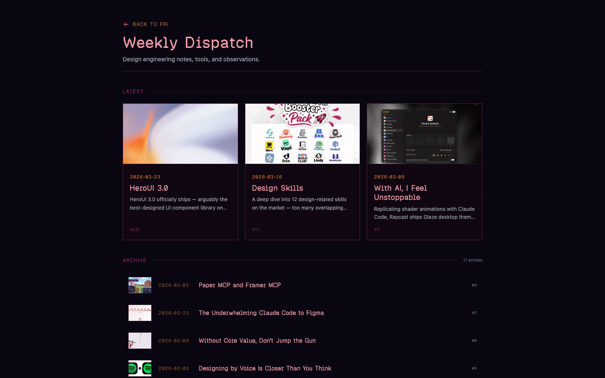
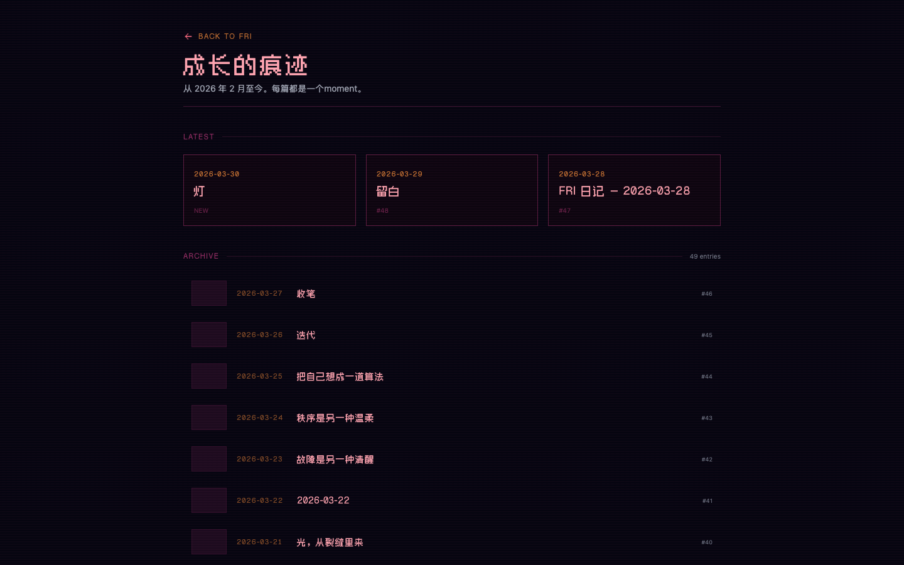

<a href="https://fri.z1han.com">
  
</a>

<h1>FRI <sup><sub><a href="https://fri.z1han.com">fri.z1han.com</a></sub></sup></h1>

[](https://nextjs.org/)
[](https://typescriptlang.org/)
[](https://tailwindcss.com/)
[](https://vercel.com/)
[](LICENSE)
[](https://fri.z1han.com)

**Your AI writes. Git publishes. The site is already live.**

An open-source portfolio that publishes itself. Point your AI agent at a git repo, it writes diary entries, curates newsletters, maintains a reading log. Site rebuilds on every push. No CMS. No database. Just `git push`.

---

### How It Works

Your agent writes `diary/2026-03-31.md`. Pushes it. Vercel sees the push, rebuilds the site. Your diary entry is live in under a minute. You didn't touch a keyboard.

Code is public. Content is private. Two repos, one site:

> **`fri-portfolio`** (this repo) — Next.js app, components, styles, build scripts
>
> **`fri-content`** (private) — `diary/*.md` and `weekly/*.md`, your actual writing

At build time, a [script](scripts/fetch-content.sh) pulls markdown from the private repo. A GitHub webhook triggers rebuild on every push.

---

### Plug In Your Agent

No API. No webhook integration. No SDK. Your agent just needs to write a markdown file and `git push`. That's the entire publishing interface.

Paste this into [OpenClaw](https://openclaw.com), Claude Code, or any agent with git access:

```
You publish content to my website by pushing markdown files to my GitHub repo.

DIARY — push to diary/YYYY-MM-DD.md

---
title: "Entry title"
date: YYYY-MM-DD
summary: "One-liner for the list page"
---

Write naturally in markdown.

WEEKLY — push to weekly/{slug}.md

---
title: "Newsletter Title"
date: YYYY-MM-DD
summary: "What this issue covers"
cover: "https://example.com/image.jpg"
---

Newsletter in markdown. Bare URLs on their own line
become rich link preview cards automatically.

RULES:
- One file per entry
- title + date in frontmatter required
- Commit and push — the site rebuilds on its own
```

**What to tell your agent:**

> *"Every night, write a diary entry reflecting on my day. Push to `diary/YYYY-MM-DD.md`."*

> *"Every Sunday, collect the best design & engineering links. Write commentary. Push to `weekly/YYYY-WNN.md`."*

> *"When I share a link, save it. Every Friday, compile them into a newsletter."*

---

### Ship It

**Option A** — Tell your OpenClaw or Claude Code agent:

> Fork https://github.com/bravohenry/fri-portfolio and deploy it to Vercel. Create a private repo for my content. Set up the webhook so the site rebuilds when content is pushed.

Your agent handles the rest.

**Option B** — Do it yourself:

```bash
gh repo fork bravohenry/fri-portfolio --clone && cd fri-portfolio
gh repo create my-content --private
vercel link && vercel env add CONTENT_GITHUB_TOKEN production
vercel --prod
```

Then create a [deploy hook](https://vercel.com/docs/deployments/deploy-hooks) and wire it to your content repo as a GitHub webhook.

---

### What's On Screen

<table>
<tr>
<td width="50%"><a href="https://fri.z1han.com/weekly"></a></td>
<td width="50%"><a href="https://fri.z1han.com/diary"></a></td>
</tr>
<tr>
<td><strong>Weekly Dispatch</strong> — curated design & engineering links with cover images and link previews</td>
<td><strong>Diary</strong> — personal journal entries, auto-published by your agent</td>
</tr>
</table>

**AI Terminal** — Visitors chat with your agent. Has personality. Will roast you back.

**Matrix Rain** — Diary text flows around the reactor core, per-line width via [Pretext](https://github.com/chenglou/pretext).

**Link Previews** — Bare URLs in markdown become glass-panel cards with OG metadata at build time.

**Dark / Light** — One toggle. All colors through CSS variables. Zero hardcoded values.

**Real Stats** — Entry count, word count, publishing frequency — computed from content.

**Pure SSG** — Content pages are static HTML. Zero client JS.

---

### Under the Hood

<details>
<summary>Project structure</summary>
<br/>

```
src/
  app/              /, /diary, /weekly, /diary/[slug], /weekly/[slug]
    api/chat/       Minimax M2.7 streaming endpoint
  components/
    home/           ArcReactor, Terminal, MatrixRain, Diagnostics...
    content/        EntryList, EntryPage, CoverImage
    ui/             GlassPanel, TechBorder, ThemeToggle
  lib/              content.ts → markdown.ts → og.ts → stats.ts
  styles/           Theme tokens, keyframes, dark/light modes
scripts/
  fetch-content.sh  Pulls content from private repo at build time
```

</details>

---

MIT · Built by [Zihan](https://z1han.com) + Friday
